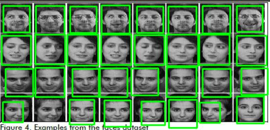
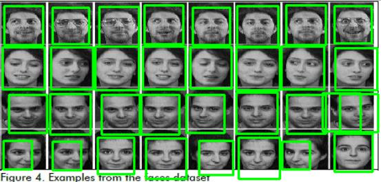

EC500 Group 2: Utilize OpenCV for human face detection (and recognition)

##※ Overview
In this mini-project we used [OpenCV](http://opencv.org/) to implement human face detection, and recognition. Programming was done in python, using the OpenCV python bindings.  Environment set up instructions can be found in [ENV_SETUP.md](/ENV_SETUP.md)

### Requirements

-  Utilize OpenCV for 2 human face detection algorithms
	- [x] Harr Cascade Face Detector
	- [x] Eigenfaces Face Recognizer
- Test on the AT&T face set
       - [x] Results for Harr Cascade
       - [x] Results for Eigenfaces
- Deliver:
      - [x] Test Set
      - [x] Training Set
      - [x] Software on Github
      - [x] Executable on Linux platform

##※ Face detection
Haar feature-based cascade is a widely-used and mature object detectioin algorithm. OpenCV has these built-in classifiers(e.g. cv2.CascadeClassifier()). It is based on such features as eye being darker than nose/cheek areas and the bridge of our nose. OpenCV has also sorted out certain features to optimize the performance by training it with image database. You can find details of this algorithm in OpenCV tutorial page here:

http://docs.opencv.org/master/d7/d8b/tutorial_py_face_detection.html#gsc.tab=0

### Code
The code we used is simple and elegant. 
Load the xml files and run the code. 

Code credit: Shantnu Tiwari. If you want to understand how the code works, the details are here:
https://realpython.com/blog/python/face-recognition-with-python/

### Usage

```
python harrcascadeface_detector.py abba.png haarcascade_frontalface_default.xml*
```

### Parameters
We performed testing with different parameters to our Harr Cascade Face Detector.

Useful parameters:

* **scaleFactor**: Compenstates for the relative size of faces due to the distance to the focal point (e.g. camera).  Increasing the scaleFactor increases the expected size of a person's face, and decreasing decreases teh expected size of a person's face.

* **minNeighbors**: The number of objects that must be detected near the current one, before the face is declared found. A low **minNeighbors** helps to detect small faces in crowded places, but also increases the number of false positives.

* **minSize**: The minimum size of each face window (e.g. the square). If faces are too small compared to the whole picture, **minSize** has to bet smaller. 

We found tuning in this order to be the easiest to get the right results:  
**minSize** -> **minNeighbors** -> **scaleFactor** -> **minNeighbors**


### Results
#### ATT scaleFactor: 1.04; minNeighbors: 2; minSize 1010


#### ATT scaleFactor: 1.05; minNeighbors: 1; minSize 1010


Notice the overlapping boxes, and other errors with the lower minNeighbors.

More results can be found in `/results`.

##※ Face recognition
>Eigenfaces is the name given to a set of eigenvectors when they are used in the computer vision problem of human face recognition. The approach of using eigenfaces for recognition was developed by Sirovich and Kirby (1987) and used by Matthew Turk and Alex Pentland in face classification. The eigenvectors are derived from the covariance matrix of the probability distribution over the high-dimensional vector space of face images.
- Wikipedia

What that means to us, is that eigenfaces is a useful algorithm/approach that uses eigenvectors and matrices to create a model for every face. You first feed a number of faces into the algorithm, to *train* it. After it's been trained, you use the *model* that was created to take a guess at the next face image you pass into it. The more training data, the better the results. 


### Code
The full code is available in [eigenface_recognizer.py](src/eigenface_recognizer.py).
The general flow of the code is as such:

1) Read in the training images  
2) Read in the testing images  
3) Train Eigenfaces into a model, by feeding it training images  
4) Test our model, with the testing images  
5) Print results  

### Usage
Before you can properly use the recognizer, you must create a CSV file that is structured as such:

```
path,id
/home/eugenek/code/EC500/assets/att_faces/s8/10.pgm,8
/home/eugenek/code/EC500/assets/att_faces/s8/1.pgm,8
...
```

The `path` is the path to a face image, and the `id` is the correct `id` of the person whose face that image is. In the above example image `s8/10.pgm` and `s8/1.pgm` correspond to `person #8`.
 
You can use  [faces_to_csv.py](src/faces_to_csv.py) to help with this initial data structuring.

And now the real fun can begin!
```
eigenface_recognizer.py --training_csv ../assets/all_faces.csv --ratio .5
[*] TRAINING: 200 images from 200 IDs.
[*] TESTING: 200 images from 200 IDs.
[*] We matched 90% correctly
```

```
eigenface_recognizer.py --training_csv ../assets/all_faces_except10th.csv --testing_csv ../assets/10th_of_all_faces_organized.csv
[*] TRAINING: 360 images from 360 IDs.
[*] TESTING: 40 images from 40 IDs.
[*] We matched 92% correctly
```

There's an extra special flag `--ascii`, that you should try out for fun :).

### Results
When fed just 50% of the ATT face set (at random), the trained model was able to predict ~90% correct of the remaining 50% used for test.

The increase in skill drops off steepy, as at 90% of the ATT face set used for training only resulted in ~92% correct predictions of the remaining 10%.

On visual inspection of the errors it gets using the ATT face set, even the team is unable to discern differences between the faces of the different people.


